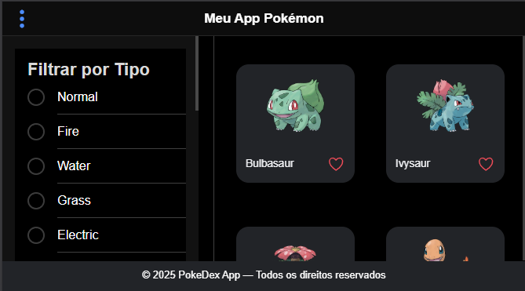
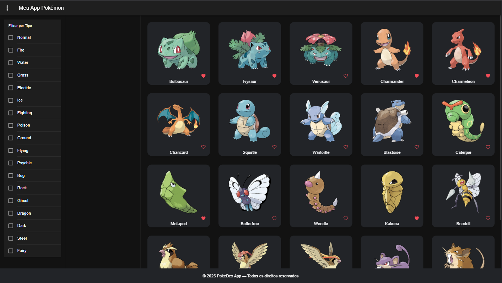
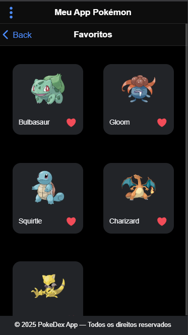
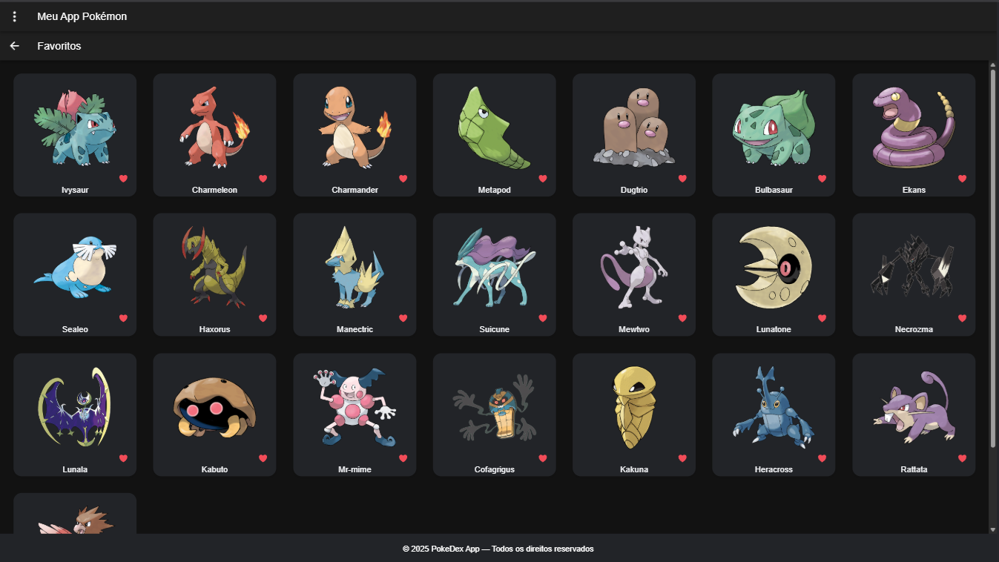
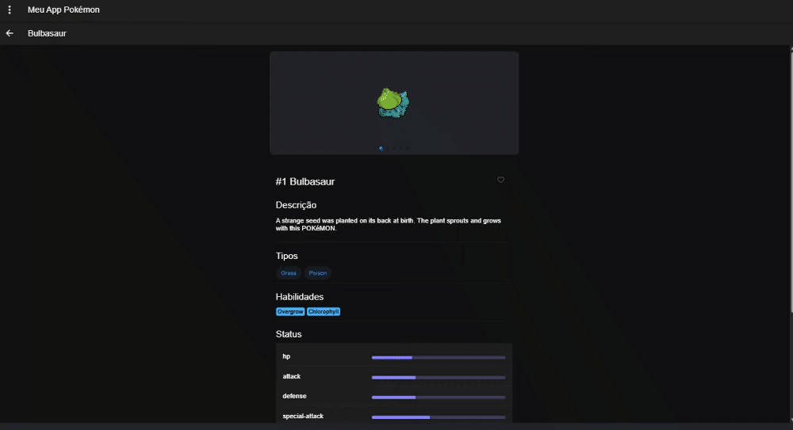
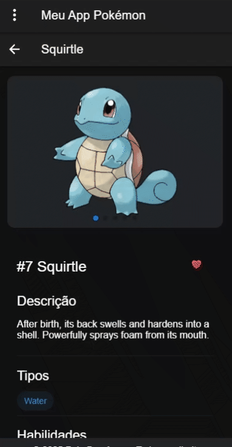
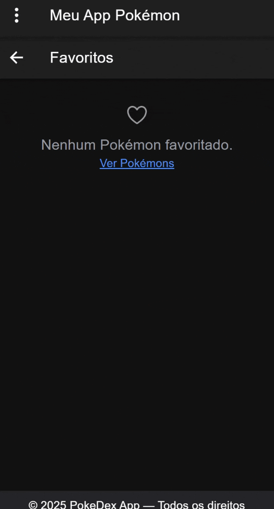

# Ionic Pokédex

Uma Pokédex responsiva desenvolvida com Ionic + Angular, consumindo a PokéAPI oficial. Permite listar, filtrar, favoritar e visualizar detalhes dos Pokémons, com foco em performance, acessibilidade e experiência mobile/desktop.

---

## 🚀 Visão Geral

- Lista de Pokémons com infinite scroll
  
  

  

  
- Filtro por tipo
  
  

  
- Favoritos salvos localmente
  
  
  
  

  
- Detalhes completos de cada Pokémon
  
  

  
- Responsivo para mobile e desktop
  
- Boas práticas de acessibilidade e performance


---

## 📦 Instalação

1. Clone o repositório:
   ```sh
   git clone https://github.com/Celsocag/ionic-pokedex.git
   cd ionic-pokedex
   ```
2. Instale as dependências:
   ```sh
   npm install
   ```

---

## ▶️ Como rodar

```sh
ionic serve
```
Acesse [http://localhost:8100](http://localhost:8100) no navegador.

---

## 🧪 Testes

Execute os testes unitários:
```sh
npm run test -- --watch=false --browsers=ChromeHeadless
```

---

## 📁 Estrutura do Projeto

```
src/
  app/
    components/           # Componentes reutilizáveis (header, footer, card, filtro)
    favorites/            # Página de favoritos
    pages/
      details/            # Página de detalhes do Pokémon
      home/               # Página inicial (lista de Pokémons)
    services/             # Serviços de negócio (Pokémon, favoritos, filtro)
    models/               # Modelos de dados (Pokemon)
  assets/                 # Imagens e SVGs
  environments/           # Configurações de ambiente
  theme/                  # Variáveis de tema SCSS
  global.scss             # Estilos globais
  index.html              # HTML principal
```

---

## 🛠️ Funcionalidades

- **Listagem:** Pokémons paginados, com carregamento infinito.
  
  
  
  

  
- **Filtro:** Por tipo de Pokémon.
  
  

  
- **Favoritos:** Adicione/remova Pokémons favoritos (persistência local).
  
  

  
  
  

  
- **Detalhes:** Imagens, tipos, habilidades, descrição, habitat e geração.
  
  

  
- **Responsividade:** Layout adaptado para mobile e desktop.
  
- **Acessibilidade:** Uso de alt, aria-label, contraste e navegação por teclado.
  
- **Performance:** Lazy loading de imagens, trackBy em listas, preconnect para APIs.

**Diferencial de UX para mobile:**




---

## 🔗 API

- [PokéAPI](https://pokeapi.co/): Fonte oficial de dados dos Pokémons.

---

## 👨‍💻 Contribuição

Pull requests são bem-vindos! Sinta-se à vontade para abrir issues ou sugerir melhorias.
